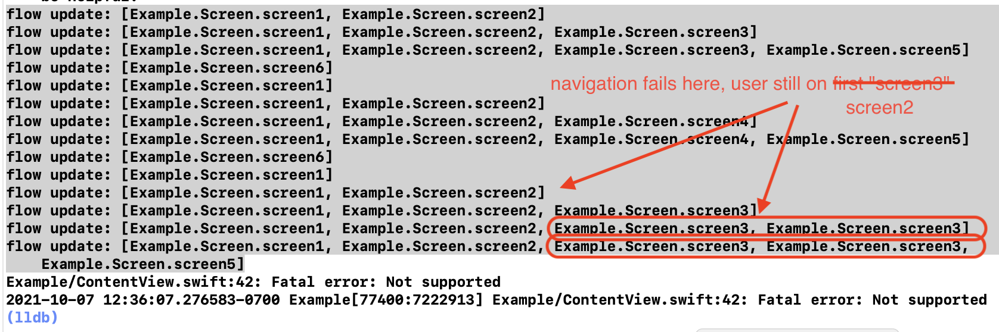

# FlowStacks-iOS-15-Bug
Demonstrating SwiftUI navigation bug affecting [FlowStacks](https://github.com/johnpatrickmorgan/FlowStacks) on iOS 15, tracked at [issue #3](https://github.com/johnpatrickmorgan/FlowStacks/issues/3).

This was also written up as a radar and submitted to Apple (`FB9685923`).

I believe this might be related to using `replaceNFlow` twice to replace the navigation root, and seems to be made worse when `Buttons` are embedded in a `LazyVStack`. It does not affect iOS 14, only iOS 15. It usually doesn't happen on the first try, and on some launches it doesn't reproduce at all. Relaunching the app and going through the whole flow a few times seems to be necessary to reproduce.



Navigation fails at ~0:20 when on Screen 2 attempting to push Screen 3, and then corrupts the internal NFlow array, where it no longer reflects the user's actual location in the navigation stack.


I'm not sure if this is related, but when launching there are some iOS-internal UIKit constraint issues:

```
2021-10-07 13:11:44.839841-0700 Example[79258:7270897] [LayoutConstraints] Unable to simultaneously satisfy constraints.
	Probably at least one of the constraints in the following list is one you don't want. 
	Try this: 
		(1) look at each constraint and try to figure out which you don't expect; 
		(2) find the code that added the unwanted constraint or constraints and fix it. 
(
    "<NSLayoutConstraint:0x6000024c6300 'BIB_Trailing_CB_Leading' H:[_UIModernBarButton:0x7fa914f2bbc0]-(6)-[_UIModernBarButton:0x7fa914f29320'Screen 1']   (active)>",
    "<NSLayoutConstraint:0x6000024c6350 'CB_Trailing_Trailing' _UIModernBarButton:0x7fa914f29320'Screen 1'.trailing <= _UIButtonBarButton:0x7fa914f28600.trailing   (active)>",
    "<NSLayoutConstraint:0x6000024c7020 'UINav_static_button_horiz_position' _UIModernBarButton:0x7fa914f2bbc0.leading == UILayoutGuide:0x600003e77020'UIViewLayoutMarginsGuide'.leading   (active)>",
    "<NSLayoutConstraint:0x6000024c7070 'UINavItemContentGuide-leading' H:[_UIButtonBarButton:0x7fa914f28600]-(6)-[UILayoutGuide:0x600003e76f40'UINavigationBarItemContentLayoutGuide']   (active)>",
    "<NSLayoutConstraint:0x6000024c4230 'UINavItemContentGuide-trailing' UILayoutGuide:0x600003e76f40'UINavigationBarItemContentLayoutGuide'.trailing == _UINavigationBarContentView:0x7fa914f26830.trailing   (active)>",
    "<NSLayoutConstraint:0x6000024bb700 'UIView-Encapsulated-Layout-Width' _UINavigationBarContentView:0x7fa914f26830.width == 0   (active)>",
    "<NSLayoutConstraint:0x6000024c45f0 'UIView-leftMargin-guide-constraint' H:|-(8)-[UILayoutGuide:0x600003e77020'UIViewLayoutMarginsGuide'](LTR)   (active, names: '|':_UINavigationBarContentView:0x7fa914f26830 )>"
)

Will attempt to recover by breaking constraint 
<NSLayoutConstraint:0x6000024c6300 'BIB_Trailing_CB_Leading' H:[_UIModernBarButton:0x7fa914f2bbc0]-(6)-[_UIModernBarButton:0x7fa914f29320'Screen 1']   (active)>

Make a symbolic breakpoint at UIViewAlertForUnsatisfiableConstraints to catch this in the debugger.
The methods in the UIConstraintBasedLayoutDebugging category on UIView listed in <UIKitCore/UIView.h> may also be helpful.
2021-10-07 13:11:44.841005-0700 Example[79258:7270897] [LayoutConstraints] Unable to simultaneously satisfy constraints.
	Probably at least one of the constraints in the following list is one you don't want. 
	Try this: 
		(1) look at each constraint and try to figure out which you don't expect; 
		(2) find the code that added the unwanted constraint or constraints and fix it. 
(
    "<NSLayoutConstraint:0x6000024c62b0 'BIB_Leading_Leading' H:|-(0)-[_UIModernBarButton:0x7fa914f2bbc0]   (active, names: '|':_UIButtonBarButton:0x7fa914f28600 )>",
    "<NSLayoutConstraint:0x6000024c7020 'UINav_static_button_horiz_position' _UIModernBarButton:0x7fa914f2bbc0.leading == UILayoutGuide:0x600003e77020'UIViewLayoutMarginsGuide'.leading   (active)>",
    "<NSLayoutConstraint:0x6000024c7070 'UINavItemContentGuide-leading' H:[_UIButtonBarButton:0x7fa914f28600]-(6)-[UILayoutGuide:0x600003e76f40'UINavigationBarItemContentLayoutGuide']   (active)>",
    "<NSLayoutConstraint:0x6000024c4230 'UINavItemContentGuide-trailing' UILayoutGuide:0x600003e76f40'UINavigationBarItemContentLayoutGuide'.trailing == _UINavigationBarContentView:0x7fa914f26830.trailing   (active)>",
    "<NSLayoutConstraint:0x6000024bb700 'UIView-Encapsulated-Layout-Width' _UINavigationBarContentView:0x7fa914f26830.width == 0   (active)>",
    "<NSLayoutConstraint:0x6000024c45f0 'UIView-leftMargin-guide-constraint' H:|-(8)-[UILayoutGuide:0x600003e77020'UIViewLayoutMarginsGuide'](LTR)   (active, names: '|':_UINavigationBarContentView:0x7fa914f26830 )>"
)

Will attempt to recover by breaking constraint 
<NSLayoutConstraint:0x6000024c62b0 'BIB_Leading_Leading' H:|-(0)-[_UIModernBarButton:0x7fa914f2bbc0]   (active, names: '|':_UIButtonBarButton:0x7fa914f28600 )>

Make a symbolic breakpoint at UIViewAlertForUnsatisfiableConstraints to catch this in the debugger.
The methods in the UIConstraintBasedLayoutDebugging category on UIView listed in <UIKitCore/UIView.h> may also be helpful.
2021-10-07 13:11:44.848922-0700 Example[79258:7270897] [LayoutConstraints] Unable to simultaneously satisfy constraints.
	Probably at least one of the constraints in the following list is one you don't want. 
	Try this: 
		(1) look at each constraint and try to figure out which you don't expect; 
		(2) find the code that added the unwanted constraint or constraints and fix it. 
(
    "<NSLayoutConstraint:0x6000024c57c0 UIView:0x7fa914f31e50.trailing == _UIBackButtonMaskView:0x7fa914f314f0.trailing   (active)>",
    "<NSLayoutConstraint:0x6000024c68f0 'Mask_Trailing_Trailing' _UIBackButtonMaskView:0x7fa914f314f0.trailing == _UIButtonBarButton:0x7fa914f28600.trailing   (active)>",
    "<NSLayoutConstraint:0x6000024c6a30 'MaskEV_Leading_BIB_Trailing' H:[_UIModernBarButton:0x7fa914f2bbc0]-(0)-[UIView:0x7fa914f31e50]   (active)>",
    "<NSLayoutConstraint:0x6000024c7020 'UINav_static_button_horiz_position' _UIModernBarButton:0x7fa914f2bbc0.leading == UILayoutGuide:0x600003e77020'UIViewLayoutMarginsGuide'.leading   (active)>",
    "<NSLayoutConstraint:0x6000024c7070 'UINavItemContentGuide-leading' H:[_UIButtonBarButton:0x7fa914f28600]-(6)-[UILayoutGuide:0x600003e76f40'UINavigationBarItemContentLayoutGuide']   (active)>",
    "<NSLayoutConstraint:0x6000024c4230 'UINavItemContentGuide-trailing' UILayoutGuide:0x600003e76f40'UINavigationBarItemContentLayoutGuide'.trailing == _UINavigationBarContentView:0x7fa914f26830.trailing   (active)>",
    "<NSLayoutConstraint:0x6000024bb700 'UIView-Encapsulated-Layout-Width' _UINavigationBarContentView:0x7fa914f26830.width == 0   (active)>",
    "<NSLayoutConstraint:0x6000024c45f0 'UIView-leftMargin-guide-constraint' H:|-(8)-[UILayoutGuide:0x600003e77020'UIViewLayoutMarginsGuide'](LTR)   (active, names: '|':_UINavigationBarContentView:0x7fa914f26830 )>"
)

Will attempt to recover by breaking constraint 
<NSLayoutConstraint:0x6000024c57c0 UIView:0x7fa914f31e50.trailing == _UIBackButtonMaskView:0x7fa914f314f0.trailing   (active)>

Make a symbolic breakpoint at UIViewAlertForUnsatisfiableConstraints to catch this in the debugger.
The methods in the UIConstraintBasedLayoutDebugging category on UIView listed in <UIKitCore/UIView.h> may also be helpful.
```